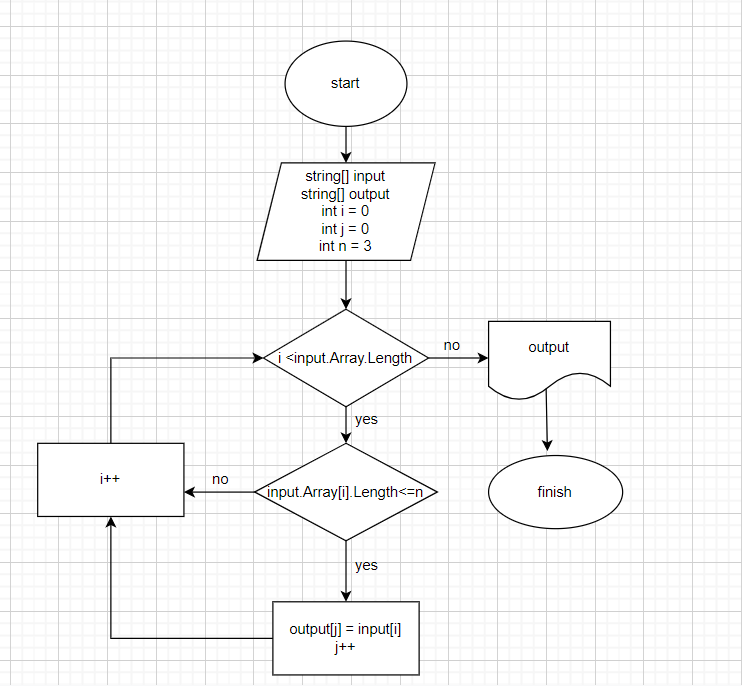

## **Итоговая работа** 
### ***Описание решения задачи:***
1. *Перебираем значения исходного массива.*
2. *Проверяем соответствует ли условию каждое значение массива, длина меньше либо равна 3-м символам.*
3. *Если условия выполняются, то данное значение переносим в новый массив.*
4. *Выводим на экран новый массив.*
### ***Добавлена блок-схема решения задачи.***
